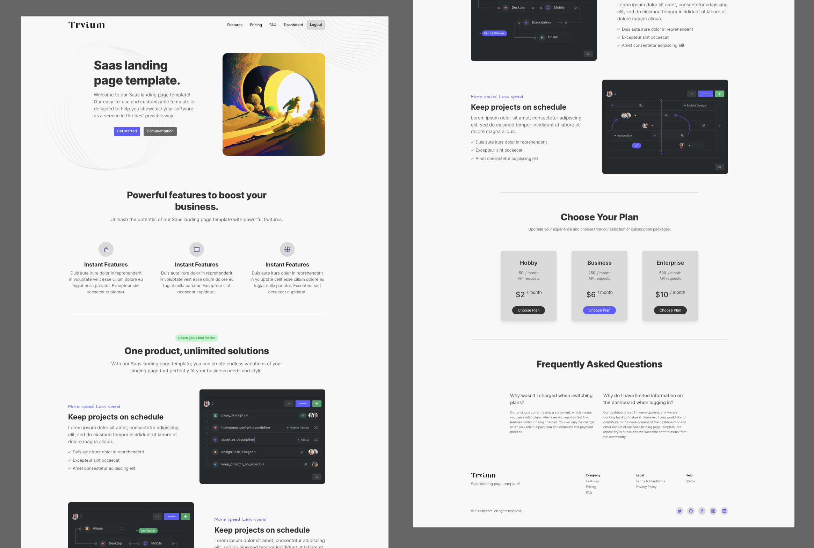

# Free Saas React / Next.js landing page template



*This template was created using the [Cruip](https://github.com/cruip/open-react-template) template as a base*

### Getting Started

First, run the development server:

```bash
npm run dev
# or
yarn dev
# or
pnpm dev
```

Open [http://localhost:3000](http://localhost:3000) with your browser to see the result.

### Learn More

To learn more about Next.js, take a look at the following resources:

- [Next.js Documentation](https://nextjs.org/docs) - learn about Next.js features and API.
- [Learn Next.js](https://nextjs.org/learn) - an interactive Next.js tutorial.

### Support notes
This template has been developed with the App Router (`app`) and React Server Components. If you’re unfamiliar with these beta features, you can find more information about them on the Next.js beta documentation page.
